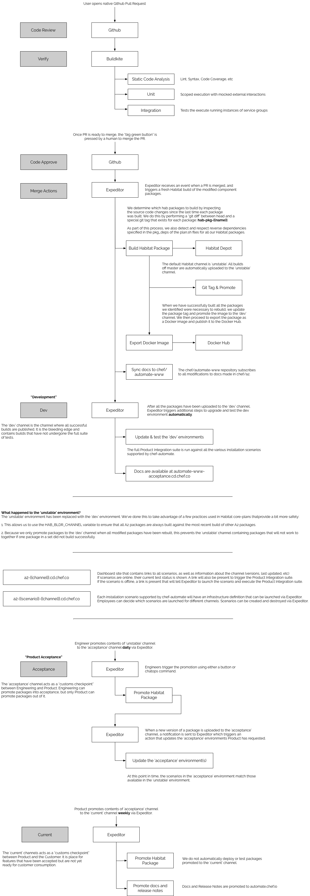

# Development

## Go Dependencies

For our Go projects, we use dep[1] to manage third-party
dependencies. Each dependency is listed in the top-level Gopkg.toml
file and the specific version/sha we lock to can be found in
Gopkg.lock. The lock file is generated by running `dep ensure` and
should not be edited directly. All dependencies are stored under
`vendor/` and *checked into git*.

**Note: `rm -rf vendor.orig` if that folder exists or you might see unexpected problems.**

[1]: https://golang.github.io/dep/

### How to add a new dependency

The first step is to run `dep ensure -add` as shown below. This will
add the new dependency to `Gopkg.toml` and `Gopkg.lock`.

```shell
dep ensure -add github.com/awesome/sauce
```

Next, make sure you have an import for the new dependency in your
code. The `dep` tool scans project source and removes dependencies
that are unused.

```go
// a2/components/$COMPONENT/pkg/somefile.go

import(
    "github.com/awesome/asuce"
)
```

Just two more steps to go!

Run `dep ensure`. This should add the files to `vendor/`.

```shell
dep ensure
```

Finally, review and prepare a PR being sure to include the new files
in `vendor/`. This is also a good time to verify the LICENSE and read
the code in the dependency you have added.

Summary:

```text
dep ensure -add github.com/awesome/sauce
# edit your project source to add the import
dep ensure
# review changes:
# - Gopkg.toml
# - Gopkg.lock
# - vendor/
# create and submit a PR
#
```

### How to update an existing dependency

Look in the `Gopkg.toml` to see if the dependency is pinned to `master`. If so, simply:

```text
dep ensure -update github.com/foo/bar
# review changes:
# - Gopkg.toml
# - Gopkg.lock
# - vendor/
# create and submit a PR
```

However, if the dependency is not pinned to `master`, modify its entry in `Gopkg.toml` to point
at the new version you want. Then, simply run `dep ensure`.

```text
# editor Gopkg.toml
# dep ensure
# review changes:
# - Gopkg.toml
# - Gopkg.lock
# - vendor/
# create and submit a PR
```

**If you see an error related to prune, then you are on an old version of dep and will
  see unexpected results in the vendor folder until you update.**

## Testing

This document should provide some guidance around testing for Automate 2.0. Since code is distributed across different project levels, the test process may not be *obvious* at the very beginning. With Automate 2.0, we introduce a two-layered testing approach. This has a couple of advantages compared to our testing in Chef Automate 1.x:

- we decouple development of each component
- a broken pipeline is not blocking all engineers
- faster testing cycle
- test output is only related to components

As a result, this leads to a point where team cannot easily block other teams anymore. The cycle-time between PR and final test result is also a lot shorter since the test scope is more aligned with the PR. Following, we define what kind of tests happen at which layer.

### Components/Services

Each component is self-contained and needs to ensure its stability. Think about a component that could also be an external solution. Each component has its own contracts like API or CLI interface. Those need to be tested with special care since any change will impact users of this components. A user may also be another component. Therefore it is essential that each component has strong interfaces and testing for those.

On a component level we test the following:

- licenses
- functional tests
- lint
- unit
- performance tests (on component level)

To achieve the goal, we have a wide range of tools available:

- [License Scout](https://github.com/chef/license_scout)
- [Unit tests for Golang](https://golang.org/pkg/testing/)
- [Karma](https://karma-runner.github.io/1.0/index.html)
- [Go Lint](https://github.com/golang/lint)
- [Go Vet](https://golang.org/cmd/vet/)
- [InSpec](https://www.inspec.io/)
- [Testify](https://github.com/stretchr/testify)
- [chakram](http://dareid.github.io/chakram/)
- [JMeter](http://jmeter.apache.org/)

The list of tools is not exclusive and is only mentioned to provide some examples about tools we already use.

**Example: Authentication**

Our authentication framework Dex (OpenID Connect) needs to verify that it works with SAML, OIDC or LDAP/AD. Since this project is an open source project, we want to ensure that all supported cases by Dex have their tests located in its [repository](https://github.com/coreos/dex).

### Acceptance

The acceptance environment is for testing interactions between services, not to test services individually. At this level we expect that a component has been tested already. Therefore we can focus on the following tests:

- integration testing
- migration testing
- regression testing
- performance tests (on integration level)

To achieve the goal, we have some tools already in use:

- [InSpec](https://www.inspec.io/)
- [JMeter](http://jmeter.apache.org/)

This is a category where we need to get stronger at. Historically, we focussed more on unit testing.

**Example: Authentication**

We already know, that Dex is able to login via LDAP and SAML. Therefore we focus on the service interactions. A sample test would look like: Can we use a token from Dex to request data from our reporting api?

## Pipeline

The below diagram outlines how changes flow through the A2 pipeline.


